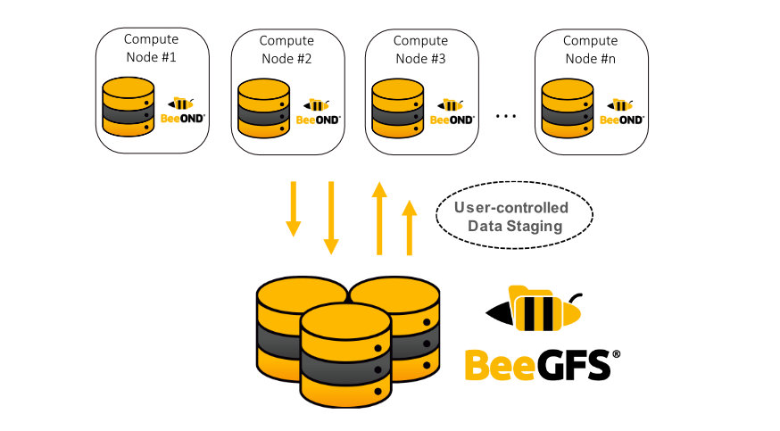

BeeOND (*Bee*GFS *On* *D*emand) 是一个Burst Buffer文件系统，其架构如下图所示：



### 准备工作

1.安装pdsh

```bash
$ apt install -y pdsh
```

2.下载包仓库文件，以`BeeGFS v7.3.2`为例：

```bash
$ wget -O /etc/apt/sources.list.d/beegfs-focal.list https://www.beegfs.io/release/beegfs_7.3.2/dists/beegfs-focal.list
$ wget -q https://www.beegfs.io/release/beegfs_7.3.2/gpg/GPG-KEY-beegfs -O- | apt-key add -
$ apt update
```

### 安装BeeOND

```bash
$ pdsh -R ssh -w node14,node27 apt install -y beeond
```

此时，若启动BeeOND，将会产生如下错误：

```bash
Unrecoverable error: No connAuthFile configured. Using BeeGFS without connection authentication is considered insecure and is not recommended. If you really want or need to run BeeGFS without connection authentication, please set connDisableAuthentication to true.
```

### 配置连接认证

根据上面的错误提示，我们继续[配置连接认证](https://doc.beegfs.io/latest/advanced_topics/authentication.html)。

1.生成共享秘钥

```bash
$ dd if=/dev/random of=/etc/beegfs/connauthfile bs=128 count=1
$ chown root:root /etc/beegfs/connauthfile
$ chmod 400 /etc/beegfs/connauthfile
```

2.将`/etc/beegfs/connauthfile`复制到集群中的所有节点

```bash
$ pdcp -R ssh -w node14,node27 /etc/beegfs/connauthfile /etc/beegfs/connauthfile
```

3.对于集群中的每个节点，修改所有服务的配置文件，指定连接认证文件的位置`connAuthFile`

```bash
$ pdsh -R ssh -w node14,node27 "sed -i 's/^\(connAuthFile.*=\).*$/\1 \/etc\/beegfs\/connauthfile/' /etc/beegfs/beegfs-*.conf"
```

### 运行BeeOND

1.生成nodefile文件，每行指定一台主机

```bash
$ cat << EOF > nodefile
node14
node27
EOF
```

2.启动BeeOND

```bash
$ beeond start -n nodefile -d /data/beeond -c /mnt/beeond -f /etc/beegfs -P
```

注意，在启动时，必须指定`-f PATH`。否则，即使我们已经设置了`connAuthFile`或`connDisableAuthentication`，仍然会产生`No connAuthFile configured`错误。

### 关闭BeeOND

```bash
$ beeond stop -n nodefile -L -d
```

### 参考文献

1. https://doc.beegfs.io/latest/quick_start_guide/quick_start_guide.html

1. https://doc.beegfs.io/latest/advanced_topics/beeond.html

1. https://doc.beegfs.io/latest/advanced_topics/authentication.html

1. https://doc.beegfs.io/latest/advanced_topics/manual_installation.html
