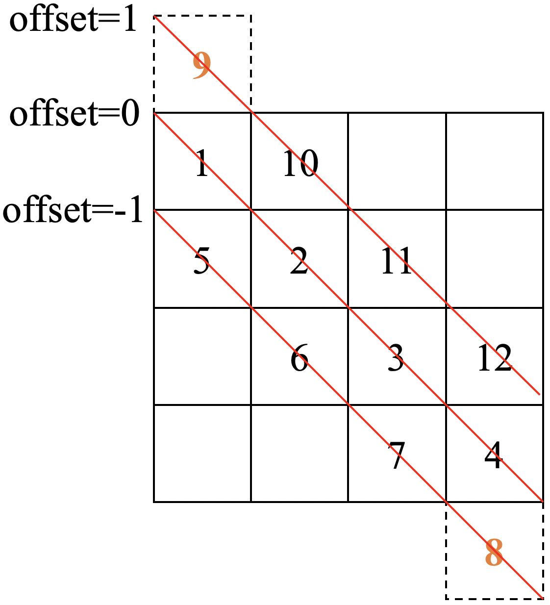

# 稀疏矩阵的存储格式

最近在做毕业论文的实验，经常用到稀疏矩阵来存储数据。本文总结了SciPy中的七大稀疏矩阵。

### spmatrix

spmatrix是一个基类，其他的稀疏矩阵都继承了该类。

属性：

* nnz：**n**umber of **n**o**n**-**z**ero，非零元素的个数。
* shape：矩阵的维度。

以如下的矩阵A为例：
$$
A = 
\begin{bmatrix}
1 & 2 & 0 & 0\\\\
0 & 3 & 4 & 0\\\\
0 & 0 & 5 & 6\\\\
0 & 0 & 0 & 7
\end{bmatrix}
$$

### coo_matrix

A sparse matrix in **COO**rdinate format，即坐标型压缩矩阵，只需要记住每个非零元素的行号、列号以及对应的值。

coo_matrix的构造函数如下所示：

```python
coo_matrix((data, (i, j)), [shape=(M, N)])
```

属性：

* **data**：非零值数组
* **row**：行索引数组
* **col**：列索引数组

实例：

```python
>>> import numpy as np
>>> from scipy.sparse import coo_matrix
>>> row = np.array([0, 0, 1, 1, 2, 2, 3])
>>> col = np.array([0, 1, 1, 2, 2, 3, 3])
>>> data = np.array([1, 2, 3, 4, 5, 6, 7])
>>> coo_matrix((data, (row, col)), shape=(4, 4)).toarray()
array([[1, 2, 0, 0],
       [0, 3, 4, 0],
       [0, 0, 5, 6],
       [0, 0, 0, 7]])
```

### csc_matrix

**C**ompressed **S**parse **C**olumn matrix。

csc_matrix的构造函数如下所示：

```python
csc_matrix((data, indices, indptr), [shape=(M, N)])
```

属性：

* data：按照列序排列（即从上到下、从左到右）的非零值数组

* indices：行索引的数组

* indptr：data的索引指针数组

示例：

```python
>>> import numpy as np
>>> from scipy.sparse import csc_matrix
>>> indptr = np.array([0, 2, 4, 6, 7])
>>> indptr = np.array([0, 1, 3, 5, 7])
>>> indices = np.array([0, 0, 1, 1, 2, 2, 3])
>>> data = np.array([1, 2, 3, 4, 5, 6, 7])
>>> csc_matrix((data, indices, indptr), shape=(4, 4)).toarray()
array([[1, 2, 0, 0],
       [0, 3, 4, 0],
       [0, 0, 5, 6],
       [0, 0, 0, 7]])
```

### csr_matrix

Compressed Sparse Row matrix。

csr_matrix的构造函数如下所示：

```python
csr_matrix((data, indices, indptr), [shape=(M, N)])
```

属性

* data：按照行序排列（即从左到右、从上到下）的非零值数组

* indices：列索引数组

* indptr：索引指针数组

基于data和indices，我们可以确定数据所在的列，但却无法确定数据所在的行。

csr_matrix使用indptr来记录数据所在的行。假设稀疏矩阵的维度为2x2，data[0:i]中的数据位于第0行，data[i:j]位于第1行，则indptr = [0, i, j]。

```python
>>> import numpy as np
>>> from scipy.sparse import csr_matrix
>>> indptr = np.array([0, 2, 4, 6, 7])
>>> indices = np.array([0, 1, 1, 2, 2, 3, 3])
>>> data = np.array([1, 2, 3, 4, 5, 6, 7])
>>> csr_matrix((data, indices, indptr), shape=(4, 4)).toarray()
array([[1, 2, 0, 0],
       [0, 3, 4, 0],
       [0, 0, 5, 6],
       [0, 0, 0, 7]])
```

###  dia_matrix

dia_matrix的构造函数如下所示：

```python
dia_matrix((data, offsets), shape=(M, N))
```

属性：

* data：非零值数组
* offsets：相对于主对角线的偏移数组。

当offset=0时，表示对应的数据在主对角线上；当offset>0时，表示数据位于主对角线的上方；否则，表示数据位于主对角性的下方。

示例：

```python
>>> import numpy as np
>>> from scipy.sparse import dia_matrix
>>> data = np.array([[1, 2, 3, 4], [5, 6, 7, 8], [9, 10, 11, 12]])
>>> offsets = np.array([0, -1, 1])
>>> dia_matrix((data, offsets), shape=(4, 4)).toarray()
array([[ 1, 10,  0,  0],
       [ 5,  2, 11,  0],
       [ 0,  6,  3, 12],
       [ 0,  0,  7,  4]])
```

解释：超出目标矩阵维度的部分会被截断。



### dok_matrix

**D**ictionary **O**f **K**eys based sparse matrix。


### lil_matrix

Row-based **li**st of **l**ists sparse matrix.

数据结构：

- An array (`self.rows`) of rows, each of which is a sorted list of column indices of non-zero elements.
- The corresponding nonzero values are stored in similar fashion in `self.data`.

