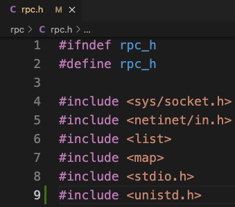

# Lab 1: Lock Server

### 准备工作

首先，我们需要下载Lab1的源代码：

```bash
$ git clone https://pdos.csail.mit.edu/archive/6.824-2012/yfs-class.git
```

接着，尝试编译源代码：

```bash
$ make
```

此时，编译器会产生如下错误信息：

```bash
rpc/rpc.cc:98:32: error: ‘getpid’ was not declared in this scope; did you mean ‘getpt’?
```

不要慌，产生这种错误的原因是代码中没有引用对应的头文件。getpid()的函数声明在unistd.h中，因此，我们只需要在`rpc/rpc.h`中引用该头文件，就可以修复上述错误。




#### Step One: 实现lock_server（假定完美网络）

##### 使用RPC系统

在`lock_smain.cc`中，向RPC服务器注册RPC处理程序

```c++
server.reg(lock_protocol::acquire, &ls, &lock_server::acquire);
server.reg(lock_protocol::release, &ls, &lock_server::release);
```

##### 实现锁客户端

参考stat调用，实现`acquire`和`release`调用

```c++
lock_protocol::status
lock_client::acquire(lock_protocol::lockid_t lid)
{
  bool r;
  return cl->call(lock_protocol::acquire, cl->id(), lid, r);
}

lock_protocol::status
lock_client::release(lock_protocol::lockid_t lid)
{
  bool r;
  return cl->call(lock_protocol::release, cl->id(), lid, r);
}
```

##### 处理多线程并发

* 使用C++11提供的mutex和condition_variable

1.修改`lock_server.h`：在lock_server类中定义互斥量和条件变量

```c++
enum lock_status { FREE, LOCKED };
std::mutex mtx;
std::condition_variable cv;
std::map<lock_protocol::lockid_t, lock_status> lock_states;
```

2.修改`lock_server.cc`：实现acquire和release函数

```c++
lock_protocol::status
lock_server::acquire(int clt, lock_protocol::lockid_t lid, bool &r)
{
  std::unique_lock<std::mutex> lock(mtx);

  // 如果锁不存在，则创建锁，并授予锁
  if (lock_states.find(lid) == lock_states.end()) {
    lock_states[lid] = LOCKED;
    r = true;
    return lock_protocol::OK;
  }

  // 如果锁被占用，则等待锁释放
  while (lock_states[lid] == LOCKED) {
    cv.wait(lock);
  }

  // 授予锁
  lock_states[lid] = LOCKED;
  r = true;
  return lock_protocol::OK;
}

lock_protocol::status
lock_server::release(int clt, lock_protocol::lockid_t lid, bool &r)
{
  std::lock_guard<std::mutex> lock(mtx);
  lock_states[lid] = FREE;
  r = true;
  cv.notify_all();
  return lock_protocol::OK;
}
```

使用pthread库来实现上述功能：

1.修改`lock_server.h`：在lock_server类中定义互斥量和条件变量

```c++
pthread_mutex_t mtx;
pthread_cond_t cond;
std::map<lock_protocol::lockid_t, lock_status> lock_states;
```

2.修改`lock_server.cc`：实现互斥量和条件变量的初始化和销毁

```c++
lock_server::lock_server():
  nacquire (0)
{
  pthread_mutex_init(&mtx, NULL);
  pthread_cond_init(&cond, NULL);
}

lock_server::~lock_server()
{
  pthread_mutex_destroy(&mtx);
  pthread_cond_destroy(&cond);
}
```

3.修改`lock_server.cc`：实现acquire和release函数

```c++
lock_protocol::status
lock_server::acquire(int clt, lock_protocol::lockid_t lid, bool &r)
{
  pthread_mutex_lock(&mtx);

  // 如果锁不存在，则创建锁，并授予锁
  if (lock_states.find(lid) == lock_states.end()) {
    lock_states[lid] = LOCKED;
    r = true;
    pthread_mutex_unlock(&mtx);
    return lock_protocol::OK;
  }

  // 如果锁被占用，则等待锁释放
  while (lock_states[lid] == LOCKED) {
    pthread_cond_wait(&cond, &mtx);
  }

  // 授予锁
  lock_states[lid] = LOCKED;
  r = true;
  pthread_mutex_unlock(&mtx);
  return lock_protocol::OK;
}

lock_protocol::status
lock_server::release(int clt, lock_protocol::lockid_t lid, bool &r)
{
  pthread_mutex_lock(&mtx);
  lock_states[lid] = FREE;
  r = true;
  pthread_cond_broadcast(&cond);
  pthread_mutex_unlock(&mtx);
  return lock_protocol::OK;
}
```

* 测试

```shell
$ ./lock_server 3772 &
[1] 226219
$ ./lock_tester 3772
simple lock client
acquire a release a acquire a release a
acquire a acquire b release b release a
test2: client 1 acquire a release a
test2: client 0 acquire a release a
... # 省略一些输出
./lock_tester: passed all tests successfully
```

### 参考文献

1. https://pdos.csail.mit.edu/archive/6.824-2012/labs/lab-1.html
