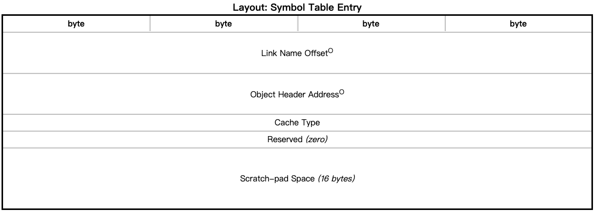
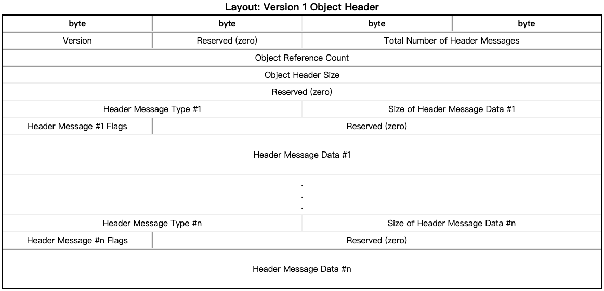
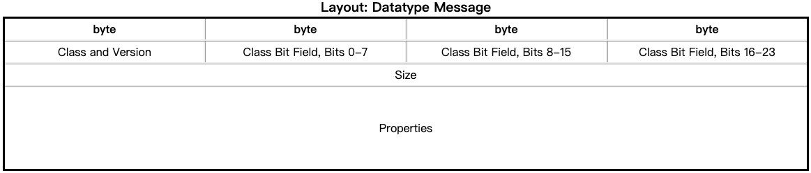
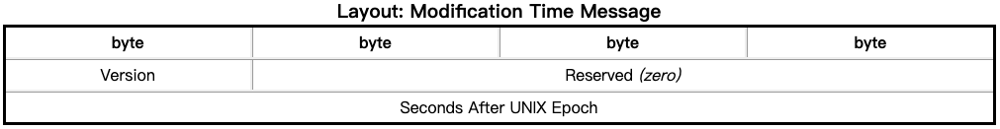

以HDF5官网中的列举的`h5ex_d_chunk.h5`为例

```bash
wget https://support.hdfgroup.org/ftp/HDF5/examples/files/exbyapi/h5ex_d_chunk.h5
```

### Superblock


```bash
[root@hgs ~]# hexdump -Cn 56 h5ex_d_chunk.h5
00000000  89 48 44 46 0d 0a 1a 0a  00 00 00 00 00 08 08 00  |.HDF............|
00000010  04 00 10 00 00 00 00 00  00 00 00 00 00 00 00 00  |................|
00000020  ff ff ff ff ff ff ff ff  b0 10 00 00 00 00 00 00  |................|
00000030  ff ff ff ff ff ff ff ff                           |........|
00000038
```

Size of Offsets：8个字节

Size of Lengths：8个字节

> 图中上标为O的字段大小为Size of Offsets，上标为L的字段大小为Size of Lengths。

因此，超级块共占用96个字节。

Group Leaf Node K：4，Group B-tree的每个叶子结点至少包含K个项，但不超过2K

Group Internal Node K：16，Group B-tree的每个非叶子结点包含至少包含K个项，但不超过2K

End of File Address：HDF5文件结束的位置。在当前例子中，该地址为0x10b0=4272，表明该文件共占用4272个字节。

### Symbol Table Entry




```bash
[root@hgs ~]# hexdump -Cs 0x38 -n 40 h5ex_d_chunk.h5 
00000038  00 00 00 00 00 00 00 00  60 00 00 00 00 00 00 00  |........`.......|
00000048  01 00 00 00 00 00 00 00  88 00 00 00 00 00 00 00  |................|
00000058  a8 02 00 00 00 00 00 00                           |........|
00000060
```

Object Header Address: 0x60

Cache Type：1，表明Scratch-pad Space中缓存了元数据：


Address of B-tree: 0x88

Address of Name Heap: 0x02a8

### Object Header




```bash
[root@hgs ~]# hexdump -Cs 0x60 -n 40 h5ex_d_chunk.h5
00000060  01 00 01 00 01 00 00 00  18 00 00 00 00 00 00 00  |................|
00000070  11 00 10 00 00 00 00 00  88 00 00 00 00 00 00 00  |................|
00000080  a8 02 00 00 00 00 00 00                           |........|
00000088
```

Object Header Size：0x18 = 24，加上前面的16个字节，共计40个字节。

只有一个头消息，类型为0x11，通过查看文件格式说明书发现，该类型为`Symbol Table Message`，布局如下：


和`Scratch-pad Space`中存储的内容相同。

### B-tree Nodes


$$
544=8 + 8 + 8 + 2×16×8 + (2×16+1)×8\\\\
0x02a8 - 0x0088 = 0x0220 = 544
$$

因此，共占用544个字节

```bash
[root@hgs ~]# hexdump -Cs 0x88 -n 544 h5ex_d_chunk.h5 
00000088  54 52 45 45 00 00 01 00  ff ff ff ff ff ff ff ff  |TREE............|
00000098  ff ff ff ff ff ff ff ff  00 00 00 00 00 00 00 00  |................|
000000a8  30 04 00 00 00 00 00 00  08 00 00 00 00 00 00 00  |0...............|
000000b8  00 00 00 00 00 00 00 00  00 00 00 00 00 00 00 00  |................|
*
000002a8
```

孩子1的地址：0x0430

### Local Heap


共占用32个字节。

```bash
[root@hgs ~]# hexdump -Cs 0x02a8 -n 32 h5ex_d_chunk.h5 
000002a8  48 45 41 50 00 00 00 00  58 00 00 00 00 00 00 00  |HEAP....X.......|
000002b8  10 00 00 00 00 00 00 00  c8 02 00 00 00 00 00 00  |................|
000002c8
```

1.Data Segment Size = 0x58 = 88

2.Offset to Head of Free-list = 0x10

3.Address of Data Segment = 0x02c8

```bash
[root@hgs ~]# hexdump -Cs 0x02c8 -n 0x58 h5ex_d_chunk.h5 
000002c8  00 00 00 00 00 00 00 00  44 53 31 00 00 00 00 00  |........DS1.....|
000002d8  01 00 00 00 00 00 00 00  48 00 00 00 00 00 00 00  |........H.......|
000002e8  00 00 00 00 00 00 00 00  00 00 00 00 00 00 00 00  |................|
*
00000318  00 00 00 00 00 00 00 00                           |........|
00000320
```

其中，0x01表示其为最后一个空闲块，0x48表示该空闲块的大小。

**开头为什么要放8个0？？？**

### Symbol Table Node


$$
8 + 2 K \times 40 = 8 + 2 \times 4 \times 40 = 328
$$

```bash
[root@hgs ~]# hexdump -Cs 0x0430 -n 328 h5ex_d_chunk.h5 
00000430  53 4e 4f 44 01 00 01 00  08 00 00 00 00 00 00 00  |SNOD............|
00000440  20 03 00 00 00 00 00 00  00 00 00 00 00 00 00 00  | ...............|
00000450  00 00 00 00 00 00 00 00  00 00 00 00 00 00 00 00  |................|
*
00000570  00 00 00 00 00 00 00 00                           |........|
00000578
```


Link Name Offset: 从Local Heap的第8个字节开始

Object Header Address：0x0320

### Object Header


继续看下对象头：

```bash
[root@hgs ~]# hexdump -Cs 0x0320 -n 272 h5ex_d_chunk.h5 
00000320  01 00 06 00 01 00 00 00  00 01 00 00 00 00 00 00  |................|
00000330
```

从上面的输出可看出：共有6个头消息，对象头大小为0x0100=256个字节

1.

```bash
[root@hgs ~]# hexdump -Cs 0x0330 -n 16 h5ex_d_chunk.h5 
00000330  05 00 08 00 01 00 00 00  02 03 02 01 00 00 00 00  |................|
00000340
```

第一个头消息的类型为0x0005，表明其为`Fill Value Message`。

头消息的大小为8个字节，Header Message Flags = 1，表明该消息为共享消息。


* Version：02

* Space Allocation Time：03

* Fill Value Write Time：02

* Fill Value Defined：01，表明该数据集定义了填充值。

* Size：Fill Value占用的字节数。因为当前的版本号大于1，所以没有Size字段。
* Fill Value：填充值，占用的字节数与数据集中数据类型相同。因为当前的版本号大于1，所以被设置为0。

2.

```bash
[root@hgs ~]# hexdump -Cs 0x0340 -n 24 h5ex_d_chunk.h5 
00000340  03 00 10 00 01 00 00 00  10 08 00 00 04 00 00 00  |................|
00000350  00 00 20 00 00 00 00 00                           |.. .....|
00000358
```

第二个头消息的类型为0x0003，表明其为`Datatype Message`，头消息大小为0x10=16。



* Version：1，Class = 0，定点数

* Class Bit Field：`0x08`按照低位优先的顺序为：00010000，1表明定点数以补码的形式存储。

* Size：4个字节，即int

* Bit Precision：0x20 = 32，表明定点数占用32位。


3.

```bash
[root@hgs ~]# hexdump -Cs 0x0358 -n 32 h5ex_d_chunk.h5 
00000358  01 00 18 00 00 00 00 00  01 02 00 00 00 00 00 00  |................|
00000368  06 00 00 00 00 00 00 00  08 00 00 00 00 00 00 00  |................|
00000378
```

第三个头消息的类型为0x0001，表明其为`Dataspace Message`。


Dimensionality：2，表明该数据集是二维数组。

Flags：00，第一位为0表明Maximum Dimension字段不存在；第二位为0表明Permutation Index字段不存在。

Dimension #1 Size：6

Dimension #2 Size：8

因此，我们可以得出：该数据集存储的是一个6×8的二维数组。

4.

```bash
[root@hgs ~]# hexdump -Cs 0x0378 -n 32 h5ex_d_chunk.h5 
00000378  08 00 18 00 01 00 00 00  03 02 03 78 05 00 00 00  |...........x....|
00000388  00 00 00 04 00 00 00 04  00 00 00 04 00 00 00 00  |................|
00000398
```

第四个头消息的类型为0x0008，表明其为`Data Layout Message`，头消息的数据大小为0x18=24字节。


Version：03，自HDF5 1.6.3开始使用该版本号

Layout Class：2，表明其为`Chunked Storage`	


Dimensionality：3，表明在后面有三个维度大小。

Address：0x0578，查询Chunk地址的B-tree地址。

Dimension 0 - 2 Size：均为0x04，这表明数据集被切分为4个4×4的chunk。

Dataset Element Size：在数据集中，一个元素占用的字节数。在当前示例中，值为`00`。

5.

```bash
[root@hgs ~]# hexdump -Cs 0x0398 -n 16 h5ex_d_chunk.h5 
00000398  12 00 08 00 00 00 00 00  01 00 00 00 6c 2c a2 4b  |............l,.K|
000003a8
```

第五个头消息的类型为0x0012，表明其为`Object Modification Time Message`。



自1970年1月1日 0:0:0以来的秒数=$0x4ba22c6c$

6.第六个头消息的类型为0x0000，表明该消息为`The NIL Message`，消息头的大小为0x80=128字节。

```bash
[root@hgs ~]# hexdump -Cvs 0x03a8 -n 136 h5ex_d_chunk.h5
000003a8  00 00 80 00 00 00 00 00  00 00 00 00 00 00 00 00  |................|
000003b8  00 00 00 00 00 00 00 00  00 00 00 00 00 00 00 00  |................|
000003c8  00 00 00 00 00 00 00 00  00 00 00 00 00 00 00 00  |................|
000003d8  00 00 00 00 00 00 00 00  00 00 00 00 00 00 00 00  |................|
000003e8  00 00 00 00 00 00 00 00  00 00 00 00 00 00 00 00  |................|
000003f8  00 00 00 00 00 00 00 00  00 00 00 00 00 00 00 00  |................|
00000408  00 00 00 00 00 00 00 00  00 00 00 00 00 00 00 00  |................|
00000418  00 00 00 00 00 00 00 00  00 00 00 00 00 00 00 00  |................|
00000428  00 00 00 00 00 00 00 00                           |........|
00000430
```

### B-tree Nodes


```bash
[root@hgs ~]# hexdump -Cs 0x0578 -n 24 h5ex_d_chunk.h5 
00000578  54 52 45 45 01 00 04 00  ff ff ff ff ff ff ff ff  |TREE............|
00000588  ff ff ff ff ff ff ff ff                           |........|
00000590
```

Node Type：01，表明该节点指向数据块；

Entry Used：04，表明该节点有4个孩子。

从超级块中，我们已经得知：Group Internal Node K = 16，可以算出后面的key和孩子地址共占用了：
$$
4 \times 8 \times (2 \times 16 + 1) + 2 \times 16 \times 8 = 1312字节
$$

因此：

```bash
[root@hgs ~]# hexdump -Cs 0x0590 -n 1312 h5ex_d_chunk.h5 
00000590  40 00 00 00 00 00 00 00  00 00 00 00 00 00 00 00  |@...............|
000005a0  00 00 00 00 00 00 00 00  00 00 00 00 00 00 00 00  |................|
000005b0  b0 0f 00 00 00 00 00 00  40 00 00 00 00 00 00 00  |........@.......|
000005c0  00 00 00 00 00 00 00 00  04 00 00 00 00 00 00 00  |................|
000005d0  00 00 00 00 00 00 00 00  f0 0f 00 00 00 00 00 00  |................|
000005e0  40 00 00 00 00 00 00 00  04 00 00 00 00 00 00 00  |@...............|
000005f0  00 00 00 00 00 00 00 00  00 00 00 00 00 00 00 00  |................|
00000600  30 10 00 00 00 00 00 00  40 00 00 00 00 00 00 00  |0.......@.......|
00000610  04 00 00 00 00 00 00 00  04 00 00 00 00 00 00 00  |................|
00000620  00 00 00 00 00 00 00 00  70 10 00 00 00 00 00 00  |........p.......|
00000630  00 00 00 00 00 00 00 00  04 00 00 00 00 00 00 00  |................|
00000640  04 00 00 00 00 00 00 00  04 00 00 00 00 00 00 00  |................|
00000650  00 00 00 00 00 00 00 00  00 00 00 00 00 00 00 00  |................|
*
00000ab0
```

Key分为三个部分：

* 第1-4个字节：chunk占用的字节数。0x40=64，表明chunk的大小为64字节。

* 第5-8个字节：过滤器掩码。

* 第$(D+1) \times 8$个字节：Chunk在数据集中的偏移量（D表示数据集的维度数量），最后8个字节是在数据集的数据类型中的偏移量，其值始终为0。在当前例子中，$(2+1) \times 8$=24字节。

因此，每个Key占用32个字节。

| Key 1  | Child 1的地址 | Key 2  | Child 2的地址 | Key 3  | Child 3的地址 | Key 4  | Child 4的地址 | Key 5 |
| :----: | :-----------: | :------: | :-------------: | :------: | :-------------: | :------: | :-------------: | :-----: |
| (0, 0) |    0x0fb0     | (0, 4) | 0x0ff0        | (4, 0) | 0x1030        | (4, 4) | 0x1070        | (4, 4) |

对于[0xab0, 0x0fb0)，均为0：

```bash
[root@hgs ~]# hexdump -Cs 0x0ab0 -n 1280 h5ex_d_chunk.h5 
00000ab0  00 00 00 00 00 00 00 00  00 00 00 00 00 00 00 00  |................|
*
00000fb0
```

下面来看看四个子指针所指向的内容，即Chunk：

```bash
[root@hgs ~]# hexdump -Cvs 0x0fb0 -n 256 h5ex_d_chunk.h5 
00000fb0  00 00 00 00 01 00 00 00  00 00 00 00 00 00 00 00  |................|
00000fc0  01 00 00 00 01 00 00 00  00 00 00 00 01 00 00 00  |................|
00000fd0  00 00 00 00 00 00 00 00  00 00 00 00 00 00 00 00  |................|
00000fe0  00 00 00 00 01 00 00 00  00 00 00 00 00 00 00 00  |................|
00000ff0  01 00 00 00 00 00 00 00  00 00 00 00 01 00 00 00  |................|
00001000  01 00 00 00 00 00 00 00  01 00 00 00 01 00 00 00  |................|
00001010  00 00 00 00 00 00 00 00  00 00 00 00 00 00 00 00  |................|
00001020  01 00 00 00 00 00 00 00  00 00 00 00 01 00 00 00  |................|
00001030  01 00 00 00 01 00 00 00  00 00 00 00 01 00 00 00  |................|
00001040  00 00 00 00 00 00 00 00  00 00 00 00 00 00 00 00  |................|
00001050  00 00 00 00 00 00 00 00  00 00 00 00 00 00 00 00  |................|
00001060  00 00 00 00 00 00 00 00  00 00 00 00 00 00 00 00  |................|
00001070  01 00 00 00 00 00 00 00  01 00 00 00 01 00 00 00  |................|
00001080  00 00 00 00 00 00 00 00  00 00 00 00 00 00 00 00  |................|
00001090  00 00 00 00 00 00 00 00  00 00 00 00 00 00 00 00  |................|
000010a0  00 00 00 00 00 00 00 00  00 00 00 00 00 00 00 00  |................|
000010b0
```


```bash
[root@hgs ~]# h5dump h5ex_d_chunk.h5 
HDF5 "h5ex_d_chunk.h5" {
GROUP "/" {
   DATASET "DS1" {
      DATATYPE  H5T_STD_I32LE
      DATASPACE  SIMPLE { ( 6, 8 ) / ( 6, 8 ) }
      DATA {
      (0,0): 0, 1, 0, 0, 1, 0, 0, 1,
      (1,0): 1, 1, 0, 1, 1, 0, 1, 1,
      (2,0): 0, 0, 0, 0, 0, 0, 0, 0,
      (3,0): 0, 1, 0, 0, 1, 0, 0, 1,
      (4,0): 1, 1, 0, 1, 1, 0, 1, 1,
      (5,0): 0, 0, 0, 0, 0, 0, 0, 0
      }
   }
}
}
```

综上所述，我们可以得出，示例文件的布局：


### 参考资料

1.HDF5 File Format Specification，https://portal.hdfgroup.org/display/HDF5/File+Format+Specification
