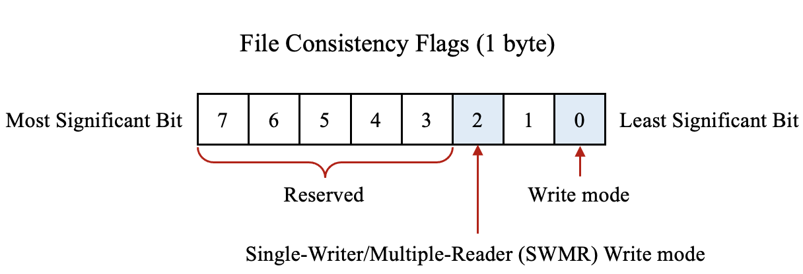

### 超级块

格式如下：


其中，File Consistency Flags占一个字节，每个比特的说明如下所示：



设置环境变量`HDF5_USE_FILE_LOCKING`：

1.如果不使用文件锁，可选的值：`FALSE`和`0`

2.如果使用文件锁，可选的值：`TRUE`、`1`和`BEST_EFFORT`

### use_file_locking的赋值过程

```c
// H5Fint.c
static herr_t
H5F__check_if_using_file_locks(H5P_genplist_t *fapl, hbool_t *use_file_locking)
{
    herr_t ret_value = SUCCEED; /* Return value */

    FUNC_ENTER_STATIC

    /* Make sure the out parameter has a value */
    *use_file_locking = TRUE;

    /* Check the fapl property */
    if (H5P_get(fapl, H5F_ACS_USE_FILE_LOCKING_NAME, use_file_locking) < 0)
        HGOTO_ERROR(H5E_FILE, H5E_CANTGET, FAIL, "can't get use file locking flag")

    /* Check the environment variable */
    if (use_locks_env_g != FAIL)
        *use_file_locking = (use_locks_env_g == TRUE) ? TRUE : FALSE;

done:
    FUNC_LEAVE_NOAPI(ret_value)
}
```

优先级：环境变量>H5Pset_file_locking>默认值

如果设置了环境变量，则使用环境变量的值；

如果手动调用了函数H5Pset_file_locking()，则使用该函数的设置；否则，默认使用文件锁。

### 加锁和标记过程

```c
// H5Fint.c: H5F_open()
hbool_t            use_file_locking = TRUE; /* Using file locks? */
hbool_t            set_flag         = FALSE; /*set the status_flags in the superblock */
hbool_t            clear            = FALSE; /*clear the status_flags         */

/* Place an advisory lock on the file */
if (use_file_locking)
    if (H5FD_lock(lf, (hbool_t)((flags & H5F_ACC_RDWR) ? TRUE : FALSE)) < 0) {
        //...
    }


/* Need to set status_flags in the superblock if the driver has a 'lock' method */
if (drvr->lock)
    set_flag = TRUE;

if (set_flag) {
    if (H5F_INTENT(file) & H5F_ACC_RDWR) { /* Set and check consistency of status_flags */
        // ...

        // 将文件标记为writing和SWMR writing模式
        file->shared->sblock->status_flags |= H5F_SUPER_WRITE_ACCESS;
        if (H5F_INTENT(file) & H5F_ACC_SWMR_WRITE)
            file->shared->sblock->status_flags |= H5F_SUPER_SWMR_WRITE_ACCESS;

        // ...

        /* Remove the file lock for SWMR_WRITE */
        if (use_file_locking && (H5F_INTENT(file) & H5F_ACC_SWMR_WRITE)) {
            if (H5FD_unlock(file->shared->lf) < 0)
                HGOTO_ERROR(H5E_FILE, H5E_CANTUNLOCKFILE, NULL, "unable to unlock the file")
        }  /* end if */
    }
    else { /* H5F_ACC_RDONLY: check consistency of status_flags */
        // ...
    }
}
```

### 自动清除标记

执行H5Fclose()时，会清除超级块中的标记，代码片段如下所示：

```c
// H5Fint.c: H5F__dest()

if (flush) {
    /* Clear status_flags */
    f->shared->sblock->status_flags &= (uint8_t)(~H5F_SUPER_WRITE_ACCESS);
    f->shared->sblock->status_flags &= (uint8_t)(~H5F_SUPER_SWMR_WRITE_ACCESS);
    // ... 
}
```

### 手动清除标记

如果程序运行时发现崩溃或者断电，超级块中的标记位将不会被清除。此时，将无法读写该文件。

HDF5提供了命令行工具h5clear，用于清除超级块中的标记，代码片段如下所示：

```c
// H5Fint.c: H5F_open()

/* This is a private property to clear the status_flags in the super block */
/* Use by h5clear and a routine in test/flush2.c to clear the test file's status_flags */
if (H5P_exist_plist(a_plist, H5F_ACS_CLEAR_STATUS_FLAGS_NAME) > 0) {
    if (H5P_get(a_plist, H5F_ACS_CLEAR_STATUS_FLAGS_NAME, &clear) < 0)
        HGOTO_ERROR(H5E_PLIST, H5E_CANTGET, NULL, "can't get clearance for status_flags")
    else if (clear)
        file->shared->sblock->status_flags = 0;
}
```

### 参考文献

[1] HDF5 File Format Specification, https://portal.hdfgroup.org/display/HDF5/File+Format+Specification#Superblock

[2] File Locking under SWMR, https://portal.hdfgroup.org/display/HDF5/File+Locking+under+SWMR

