### 下载HDFView

下载[HDFView](https://portal.hdfgroup.org/display/support/Download+HDFView)

### 创建HDF5文件

【File】→【New】→【HDF5】

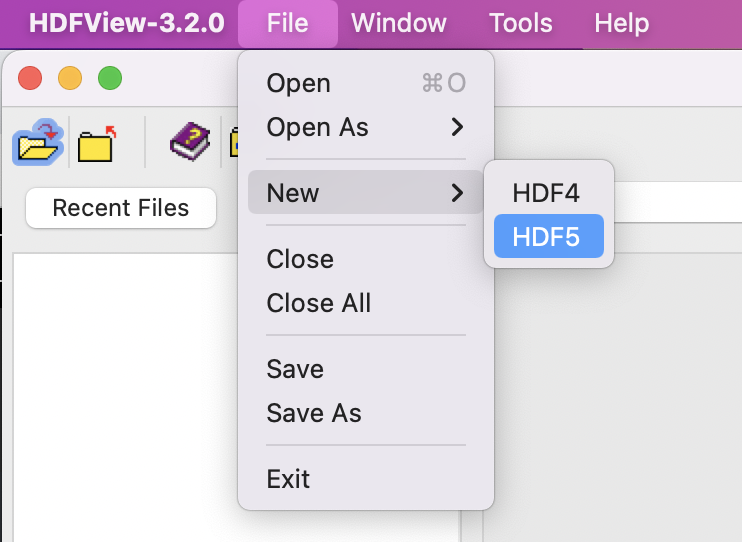

### 创建组

【右击文件名】→【New】→【Group】

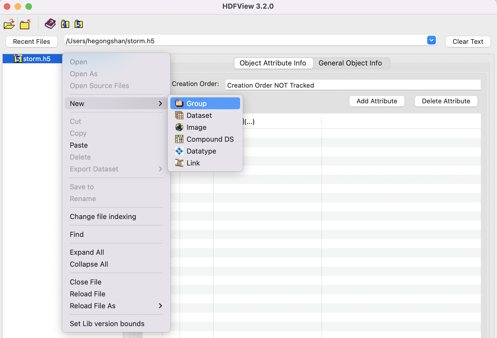

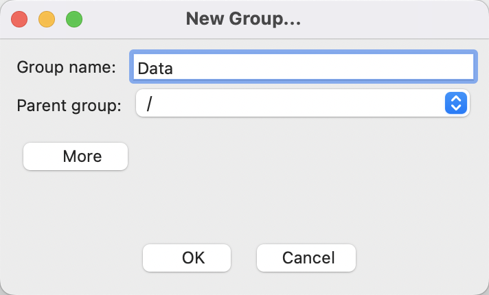

### 创建数据集

【右击文件/组】→【New】→【Dataset】

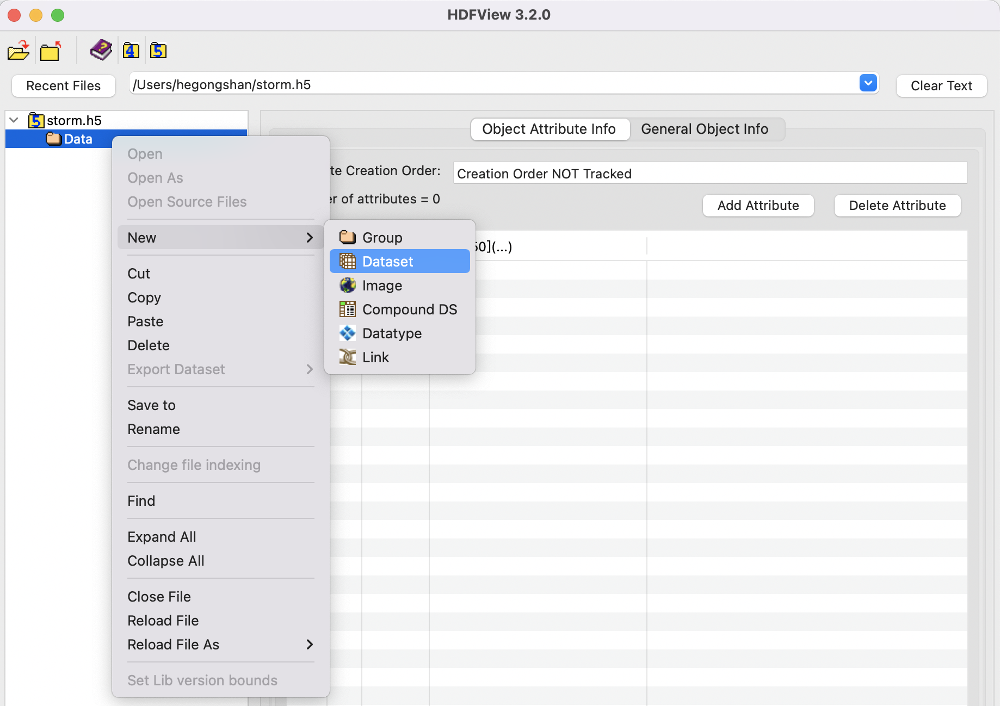

4.设置数据集的相关信息：

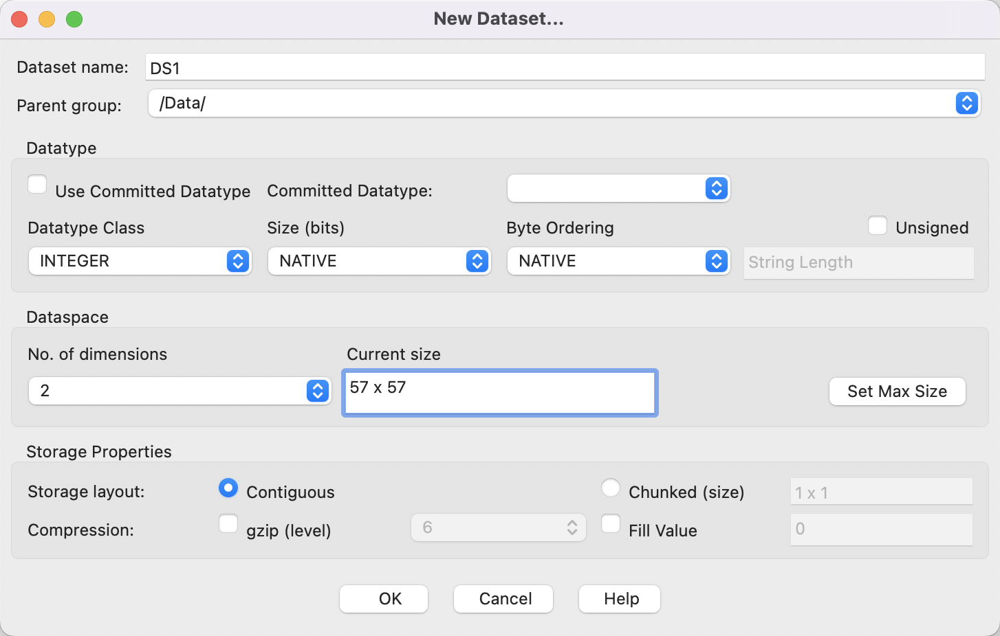

5.添加数据

示例文件：[storm1.txt](https://support.hdfgroup.org/ftp/HDF5/examples/files/tutorial/storm1.txt)

【双击数据集名】→【Import/Export Data】→【Import Data from】→【Text File】

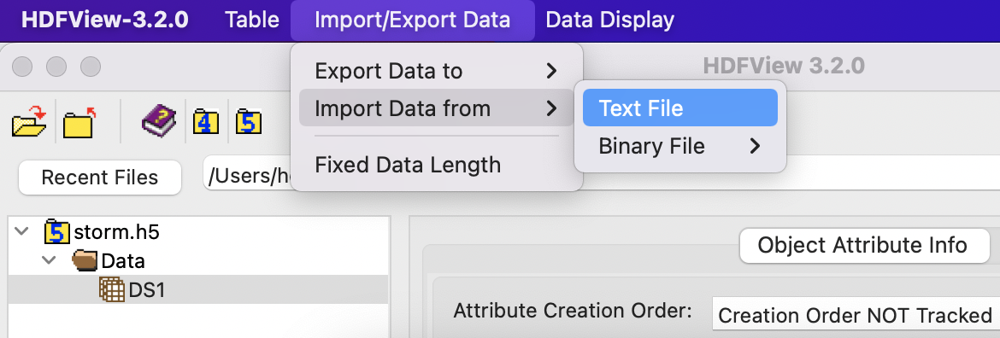

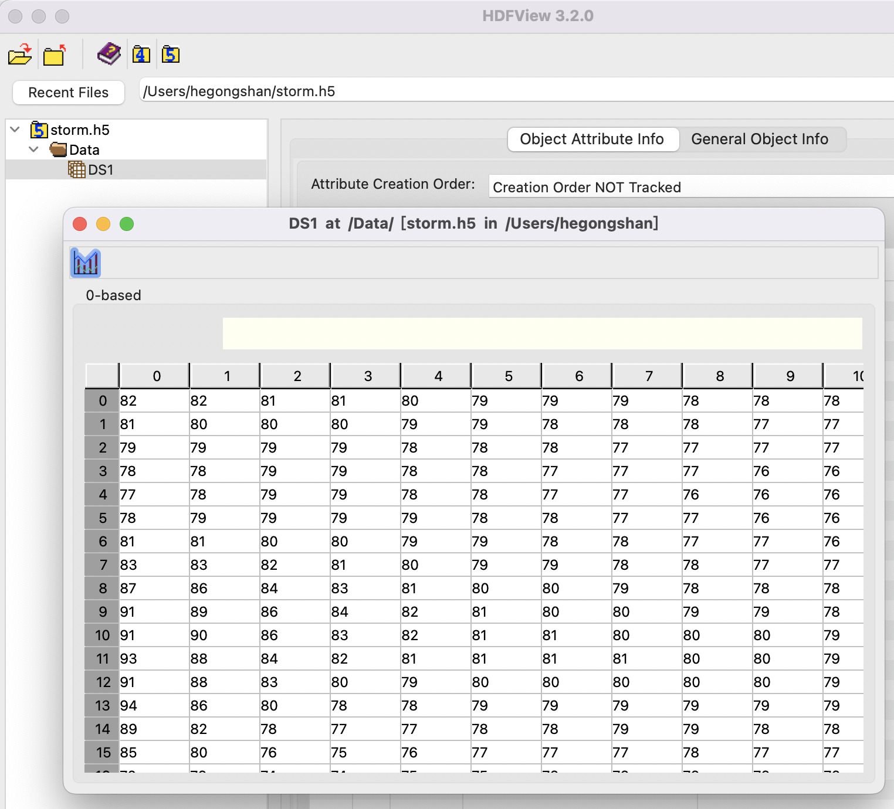

### 创建属性

【点击数据集】→【Object Attribute Info】→【Add Attribute】

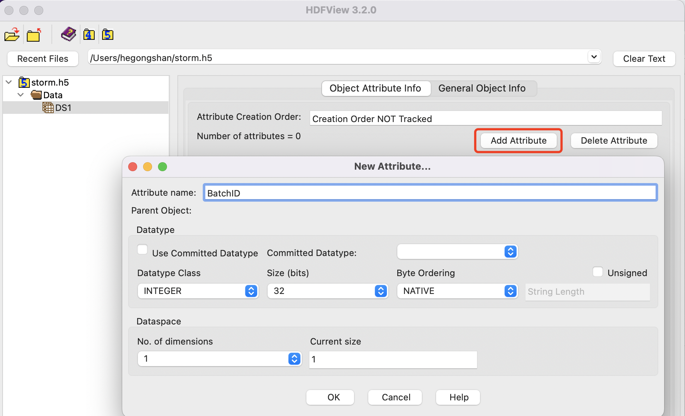

编辑属性的值

方法一：【双击属性】

方法二：【右击属性】→【View/Edit Attribute Value】

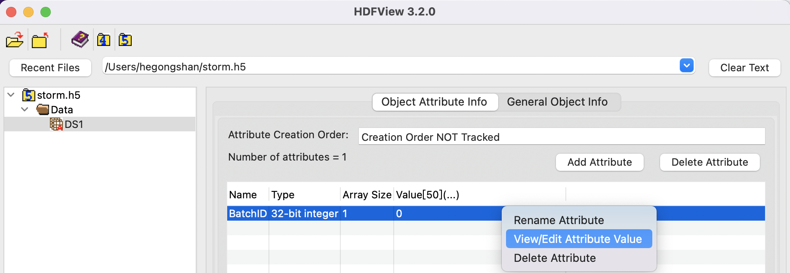

编辑单元格

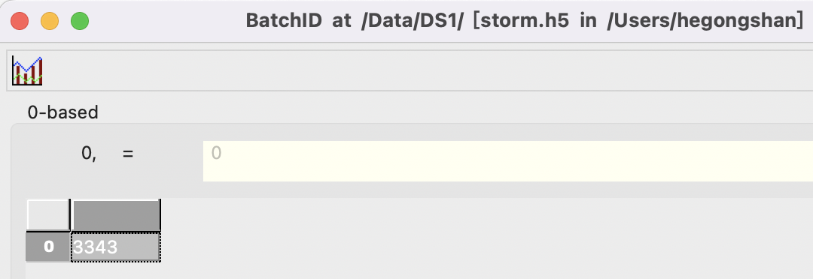

### 创建组合数据集

【右击文件/组】→【New】→【Compound Dataset】

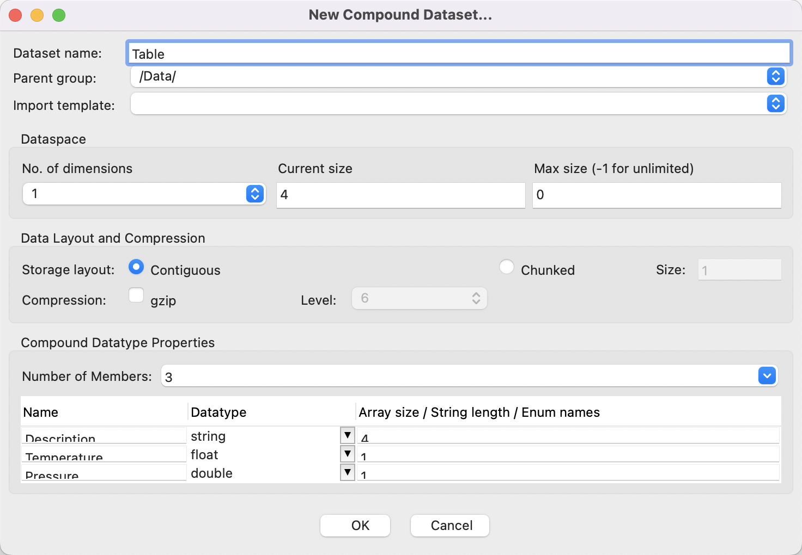

【双击数据集名】即可查看数据。

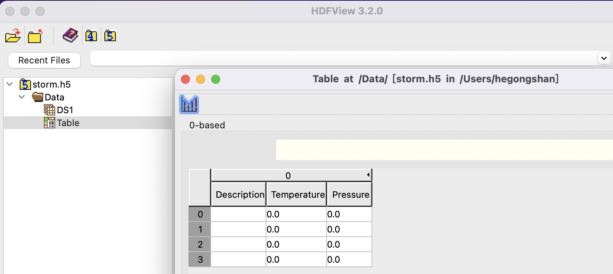

### 参考文献

1. Learning HDF5 with HDFView, https://portal.hdfgroup.org/display/HDF5/Learning+HDF5+with+HDFView
2. HDFView, https://portal.hdfgroup.org/display/HDFVIEW/HDFView
3. Download the Latest Version of HDFView, https://portal.hdfgroup.org/display/support/Download+HDFView
