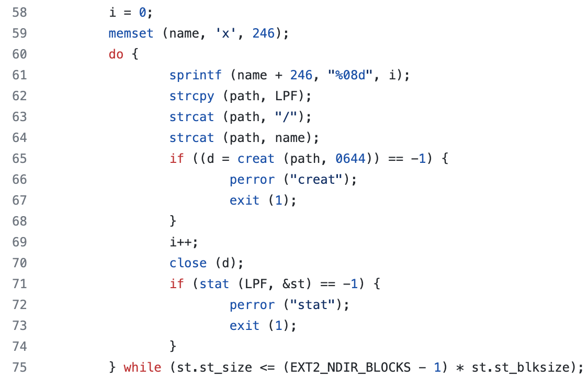
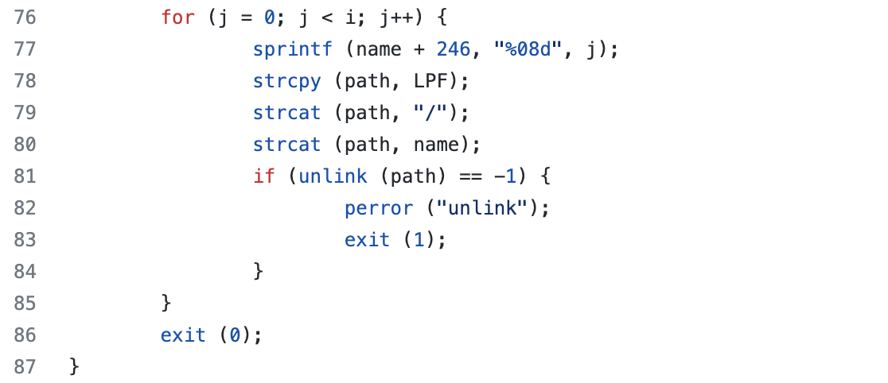

1.创建目录`lost+found`：

```c
if (mkdir (LPF, 0700) == -1) {
    perror ("mkdir");
    exit(1);
}
```

2.创建文件，填满12个块：

```c
    i = 0;
    memset(name, 'x', 246);
    do {
        sprintf(name + 246, "%08d", i);
        strcpy(path, LPF);
        strcat(path, "/");
        strcat(path, name);
        if ((d = creat(path, 0644)) == -1) {
            perror("creat");
            exit(1);
        }
        i++;
        close(d);
        if (stat(LPF, &st) == -1) {
            perror("stat");
            exit(1);
        }
    } while (st.st_size <= (EXT2_NDIR_BLOCKS - 1) * st.st_blksize);
```




3.删除创建的文件



从上面的代码可以看出：`mklost+found`的作用在于创建一个目录`lost+found`，让它占用12个块。
