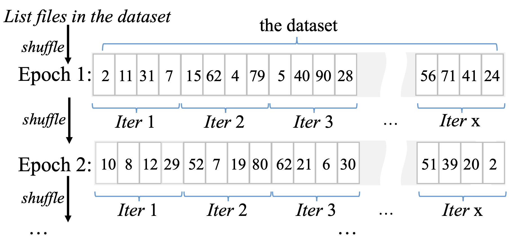
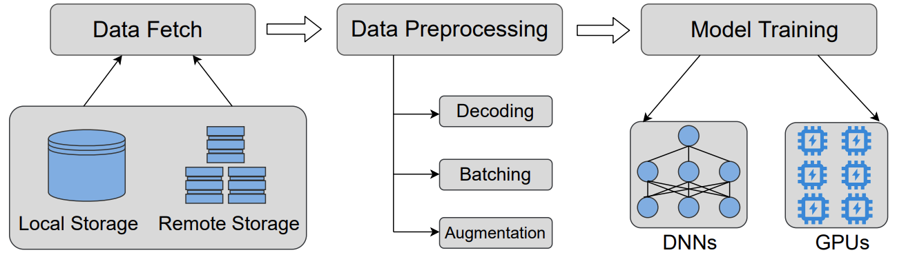

### 随机访问[1]

### 数据流水线[2]

### 参考文献

[1] Lipeng Wang, et al. DIESEL: A Dataset-Based Distributed Storage and Caching System for Large-Scale Deep Learning Training, ICPP'20

[2] Jie Liu, et al. Lobster: Load Balance-Aware I/O for Distributed DNN Training, ICPP'22