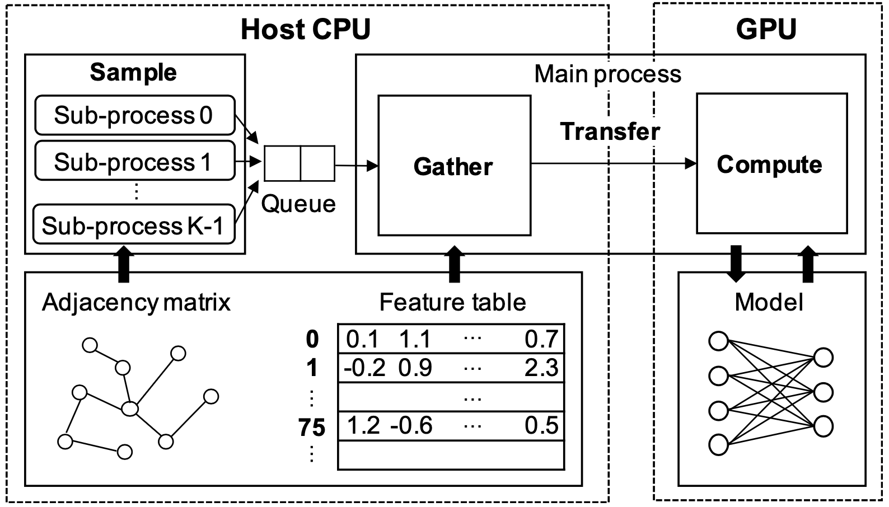

# 图神经网络（Graph Neural Network，GNN）

### 参考文献

1. Yeonhong Park, et al. Ginex: SSD-enabled Billion-scale Graph Neural Network Training on a Single Machine via Provably Optimal In-memory Caching, VLDB’22

