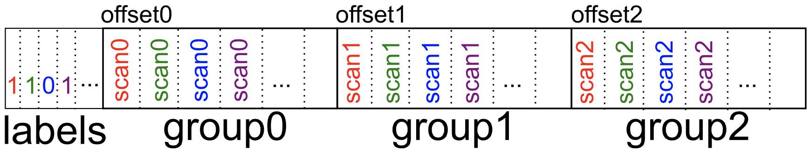

> Michael Kuchnik, et al. Progressive Compressed Records: Taking a Byte out of Deep Learning Data, VLDB'21

本文发表在数据库顶级会议VLDB'21中，作者来自于CMU。

Motivation：不同的任务对图片质量的要求不相同。

PCR的数据布局如下所示：



作者使用了现有的JPEG转换工具jpegtran：

```bash
jpegtran -copy none -optimize -progressive -outfile name
```

