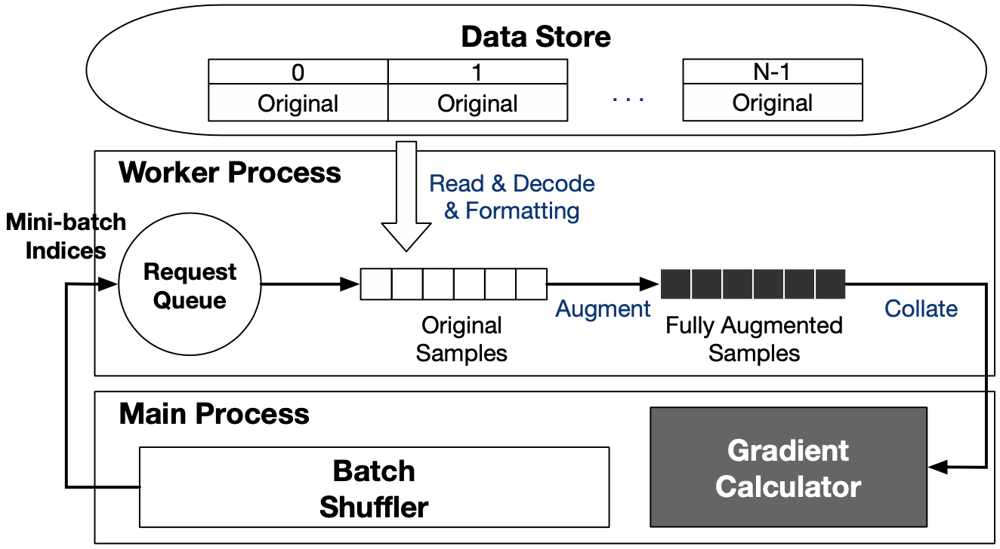

# PyTorch Dataloader

### 参考文献

1. Gyewon Lee, et al. Refurbish Your Training Data: Reusing Partially Augmented Samples for Faster Deep Neural Network Training, ATC’21
1. torch.utils.data, https://pytorch.org/docs/stable/data.html
1. datasets & dataloader, https://pytorch.org/tutorials/beginner/basics/data_tutorial.html